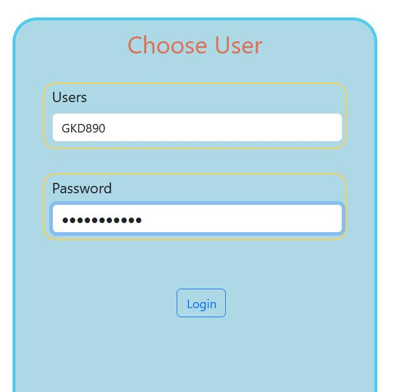

## Introduction

This is a web application aim to manage history and users from a discord bot - Budget Helper, which uses command-line like message in discord channel to manage bills among members in the same server. It's helpeful when you ususally need to share bills with your roommates.

see [discord bot - Budget Helper](https://github.com/GKD890/Budget-Helper) for how discord bot use.

## How to use it
### First time
- enter to the directory and use command `npm install` or `yarn install` to download necessary modules.
- Use `npm start` or `yarn start` to run the server.

Once you have start the script, it will be avaialbe at [http://localhost:3000](http://localhost:3000), open it in your browser.

### see recrods realte to users

